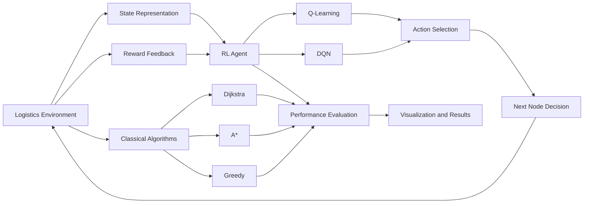

<h1 align="center">
Reinforcement Learning for Logistics Path Optimization
</h1>

<p align="center">
Q-Learning • Deep Q Network • Dijkstra • A* • Greedy
</p>
Reinforcement Learning for Logistics Path Optimization

---

## 📌 Project Overview

This project explores how **Reinforcement Learning (RL)** can be applied to solve **logistics routing problems** on graph networks.

The objective is to train an intelligent agent that learns efficient transportation routes between logistics hubs.

Implemented approaches include:

- **Q-Learning (Tabular Reinforcement Learning)**
- **Deep Q-Network (DQN)**

These approaches are compared with classical path planning algorithms:

- **Dijkstra**
- **A\***
- **Greedy Search**

---
## ✨ Project Highlights

- Implemented both **Q-Learning** and **Deep Q-Network (DQN)** for logistics route optimization  
- Modeled transportation networks as **graph-based logistics systems**  
- Compared reinforcement learning with **classical shortest path algorithms**  
- Visualized training reward convergence and route cost comparisons  
- Demonstrated RL applications in **intelligent transportation systems**
---

## 🗺 Logistics Network

<p align="center">

</p>

The logistics system is modeled as a **graph network**:

- **Nodes** → logistics hubs / warehouses  
- **Edges** → transportation routes  
- **Edge weights** → travel cost or distance  

The reinforcement learning agent learns how to navigate this network efficiently.

---
## 🏗 System Architecture



## 🧠 Algorithms Implemented

### Q-Learning

Tabular reinforcement learning algorithm that learns routing policies through exploration.

Features:

- Q-table learning
- Epsilon-greedy exploration
- Dynamic traffic environment
- Multi-algorithm performance comparison

---

### Deep Q-Network (DQN)

Deep reinforcement learning method using neural networks.

Key techniques:

- Experience Replay
- Target Network
- Neural Q-value approximation
- PyTorch implementation

---

## 📊 Experiment Results

The following table summarizes the performance of different routing algorithms across multiple simulation runs.

| Algorithm | Category | Avg Cost | Best Cost | Worst Cost | Success Rate |
|----------|----------|----------|----------|----------|----------|
| Q-Learning | Reinforcement Learning | 19.30 | 15 | 23 | 20/20 |
| DQN | Deep Reinforcement Learning | ~18.7 | ~15 | ~22 | 20/20 |
| Dijkstra | Graph Algorithm | 17.15 | 15 | 20 | 20/20 |
| A* | Graph Algorithm | 17.15 | 15 | 20 | 20/20 |
| Greedy | Heuristic Search | 35.27 | 16 | 48 | 15/20 |

**Observations**

- **Dijkstra and A*** consistently produce the optimal shortest paths.
- **Q-Learning and DQN** learn adaptive routing strategies through exploration.
- **Greedy search** is faster but often produces suboptimal paths and may fail in complex graphs.
- Reinforcement learning approaches demonstrate the potential to handle **dynamic logistics environments**.

## 📊 Training Results

Example DQN training results:

Episode 500 Reward: -100

Episode 1000 Reward: 45

Episode 1500 Reward: 47

Episode 2000 Reward: 47

Episode 2500 Reward: 47

Episode 3000 Reward: 47


Testing result:

Path: A -> C -> F -> J -> L

Test Reward: 47

Reached Goal: True


The agent successfully learns an efficient route from source to destination.


### Training Reward Curve

<p align="center">

</p>

---

### Smoothed Reward Curve

<p align="center">

</p>

---


## 📊 Algorithm Comparison

The project evaluates **Reinforcement Learning (RL)** performance against classical shortest path algorithms.

<p align="center">

</p>

| Algorithm | Category | Optimality | Avg Cost |
|-----------|----------|------------|----------|
| Q-Learning | Reinforcement Learning | Learned Policy | ~19 |
| Dijkstra | Graph Algorithm | Optimal | ~17 |
| A* | Graph Algorithm | Optimal | ~17 |
| Greedy | Heuristic Search | Not Guaranteed | ~35 |

Dijkstra and A* guarantee **optimal shortest paths**, while reinforcement learning learns **adaptive routing policies through exploration**.

---


## Project Structure

```
rl_logistics_path_planning
│
├── q_learning_project
│   ├── env.py
│   ├── q_learning_agent.py
│   ├── main.py
│   └── visualize.py
│
├── dqn_logistics_project
│   ├── main_dqn.py
│   ├── dqn_agent.py
│   ├── env.py
│   └── replay_buffer.py
│
├── outputs
│   ├── training_rewards.png
│   ├── smoothed_rewards.png
│   └── multi_algorithm_cost_comparison.png
│
└── README.md
```

---
## ⚙️ Technologies Used

- Python
- PyTorch
- NumPy
- NetworkX
- Matplotlib

---


## 🚀 How to Run

### Run Q-Learning

python q_learning_agent.py


### Run DQN

cd dqn_logistics_project
python main_dqn.py


---


## Future Improvements

Possible upgrades:

- Double DQN
- Multi-agent routing
- Traffic prediction integration
- Real-world road network using OpenStreetMap


---


## Author

Sim Kai Lin  

Computer Science and Technology  
Beijing Institute of Technology  

Research Interests:

- Reinforcement Learning
- Artificial Intelligent
- Intelligent Transportation Systems
- Logistics Optimization


